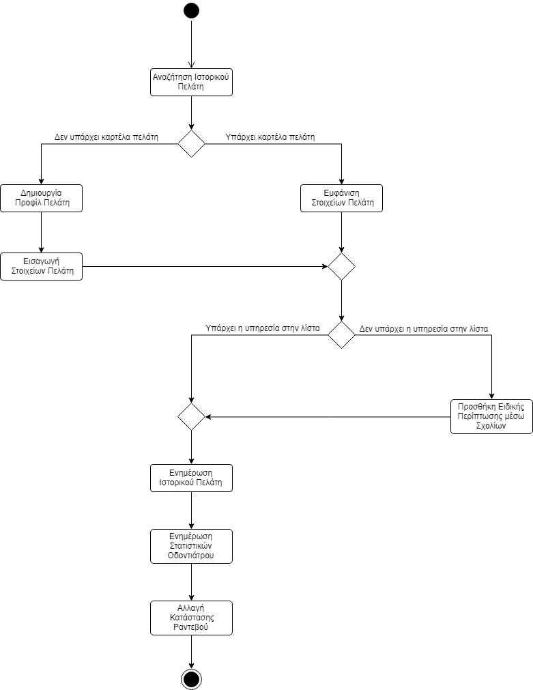

# ΠΧ1. Επίσκεψη Πελάτη

__Πρωτεύων Actor:__ Οδοντίατρος

__Ενδιαφερόμενοι:__

Οδοντίατρος: Θέλει να αποθηκεύει όλες τις υπηρεσίες που παρείχε σε κάθε πελάτη.

Πελάτης: Θέλει, ο οδοντίατρος να γνωρίζει τα στοιχεία του, έτσι ώστε να μην χρειάζεται να τα δηλώνει κάθε φορά.

__Προϋποθέσεις:__ Ο πελάτης έχει πραγματοποιήσει αίτηση για ραντεβού και αυτή έχει γίνει αποδεκτή.

## Βασική Ροή

### Α) Πραγματοποίηση Ραντεβού
1. Ο οδοντίατρος αναζητεί το ιστορικό του πελάτη βάσει αριθμού ΑΜΚΑ του πελάτη.
2. Το σύστημα εμφανίζει τα στοιχεία του λογαριασμού (Όνομα, Επώνυμο, Διεύθυνση, Τηλέφωνο Επικοινωνίας, Ηλεκτρονική Διεύθυνση, ΑΜΚΑ και παλιότερες υπηρεσίες).
3. Μετά την επίσκεψη, ο οδοντίατρος προσθέτει στο προφίλ του πελάτη, την υπηρεσία που του παρείχε.
4. Ο οδοντίατρος αλλάζει την κατάσταση ραντεβού, σε ολοκληρωμένο.

### Εναλλακτικές Ροές

*1α. Δεν βρέθηκε η καρτέλα πελάτη.*
1. Το σύστημα δεν εμφανίζει αποτέλεσμα, οπότε ο οδοντίατρος εισάγει όλα τα προσωπικά στοιχεία του πελάτη.

*3α. Ειδική περίπτωση πελάτη.*
1. Υπηρεσία η οποία δεν υπάρχει αυτούσια στην λίστα με τις υπηρεσίες, επομένως ο οδοντίατρος επιλέγει την βασίκη υπηρεσία απο την λίστα και μετά μπορεί να προσθέσει σχόλια.

# Διαγράμματα
## Διάγραμμα δραστηριότητας - Επίσκεψη Πελάτη

## Διάγραμμα ακολουθίας - Επίσκεψη Πελάτη
